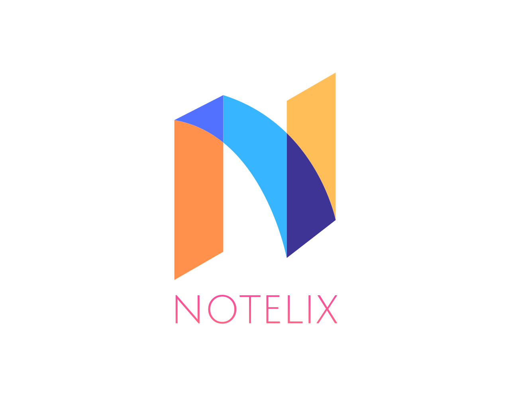
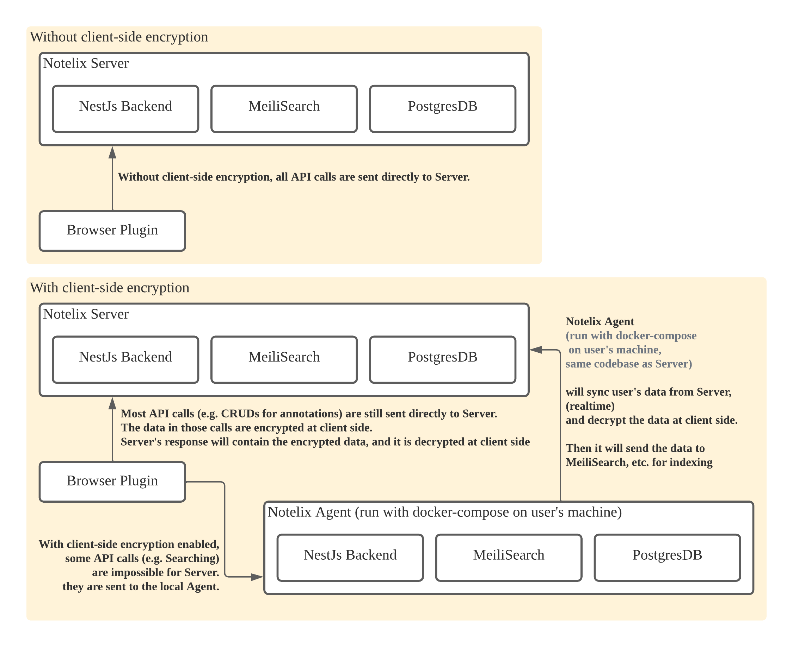

# Notelix



An open source web note taking / highlighter software (with backend).


Notelix features:

* Powerful and reliable web highlighting (powered by
  MIT-licensed [@notelix/web-marker](https://github.com/notelix/web-marker))
* Adding notes to highlights
* A search engine for your highlights and notes (powered by [MeiliSearch](https://github.com/meilisearch/meilisearch))
* An app to manage your highlights and notes in one place
* Optional client-side encryption (and an optional agent that runs on user's machine if they have client-side encryption
  enabled and want features such as the search engine)
* Use as a chrome plugin ([download a zip](https://github.com/notelix/notelix/releases)
  and [install it](https://dev.to/ben/how-to-install-chrome-extensions-manually-from-github-1612) to try), or use it as
  a service and integrate it into your website / project without requiring users to install a
  plugin ([try it](https://public-dev.notelix.com/embedded/))
* Works well with [darkreader](https://github.com/darkreader/darkreader)
* More features coming soon...

# Building and running chrome extension

```
cd chrome-extension
./build-extension.sh
```

Then `Load unpacked` from `chrome://extensions/`

# Building and running backend

```
cd ./server
echo "DB_PASSWORD=$(echo $RANDOM$RANDOM$RANDOM | md5sum | head -c 32)" > .env.dev
docker network create notelix

# start server in dev mode

docker build . -f ./Dockerfile.dev -t notelix:dev
docker-compose -f docker-compose.dev.yml --env-file .env.dev -p notelix-dev up -d 
```

# Architecture



# Running notelix agent

> only necessary when client-side encryption is enabled

```
cd server
echo "DB_PASSWORD=123456" > .env.agent
docker network create notelix
docker build . -f ./Dockerfile.agent -t notelix:agent
docker-compose -f docker-compose.agent.yml --env-file .env.agent -p notelix-agent up -d
```

Wait a bit, refresh a tab in Chrome, then wait a bit for data to sync.

After successful data sync, you will be able to use advanced features such as searching, with client-side encryption
enabled.

# Public DEV server

```
https://public-dev.notelix.com/
```

Note: this server is free-to-use, but **doesn't provide any guarantee regarding availability or data safety**.

In fact, this database will be reset when there is major Notelix API change. (expected every year).

Only use this dev server when you are trying out Notelix.

For production use, please host your own server (see `building and running backend`), and use cron + pg_dump
or https://github.com/wal-g/wal-g to backup your database.

# Using Notelix Embedded to add it to your website without requiring users to install a browser extension

Try [here](https://public-dev.notelix.com/embedded/).
See [chrome-extension/embedded.html](./chrome-extension/embedded.html) for the code.

A note about LICENSE: If you want to integrate Notelix into your project using the above method, it's okay not to
disclose source code of your project. You only need to disclose source code for any changes made directly to Notelix.

[Contact me](mailto:me@ke.wang) if you have questions regarding LICENSE / for custom licensing.
